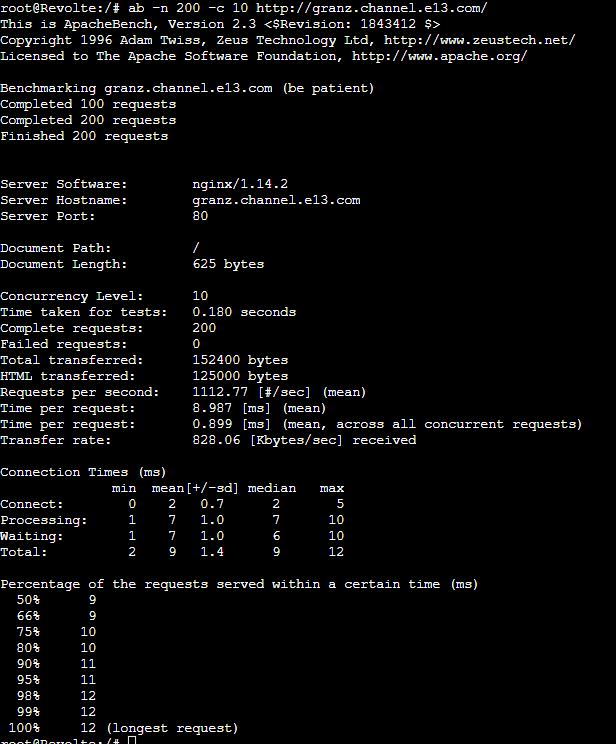
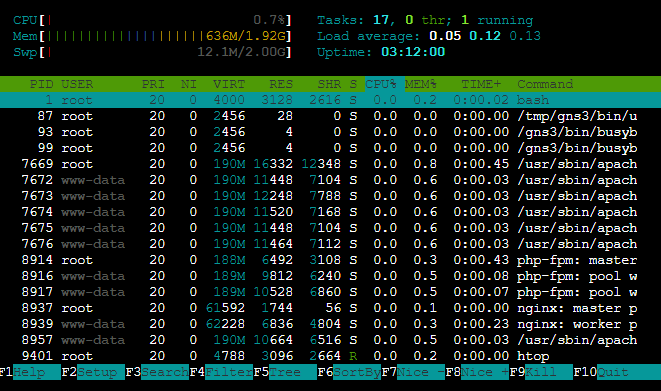

# Jarkom-Modul-3-E13-2023

| No | Nama | NRP |
|----------|----------|----------|
| 1 | Nadya Permata Sari | 5025201015 |
| 2 | Najma Ulya Agustina | 5025211239 |

<h2>Daftar Isi</h2>

| Soal | Solusi | Testing |
|----------|----------|----------|
| [Soal 1](#soal-1) | [Solusi](#solusi1) | [Testing](#testing1) |
| [Soal 2](#soal-2&3) | [Solusi](#solusi2&3) | [Testing](#testing2&3) |
| [Soal 3](#soal-2&3) | [Solusi](#solusi2&3) | [Testing](#testing2&3) |
| [Soal 4](#soal-4) | [Solusi](#solusi4) | [Testing](#testing4) |
| [Soal 5](#soal-5) | [Solusi](#solusi5) | [Testing](#testing5) |
| [Soal 6](#soal-6) | [Solusi](#solusi6) | [Testing](#testing6) |
| [Soal 7](#soal-7) | [Solusi](#solusi7) | [Testing](#testing7) |
| [Soal 8](#soal-8) | [Solusi](#solusi8) | [Testing](#testing8) |
| [Soal 9](#soal-9) | [Solusi](#solusi9) | [Testing](#testing9) |
| [Soal 10](#soal-10) | [Solusi](#solusi10) | [Testing](#testing10) |
| [Soal 11](#soal-11) | [Solusi](#solusi11) | [Testing](#testing11) |
| [Soal 12](#soal-12) | [Solusi](#solusi12) | [Testing](#testing12) |
| [Soal 13](#soal-13) | [Solusi](#solusi13) | [Testing](#testing13) |
| [Soal 14](#soal-14) | [Solusi](#solusi14) | [Testing](#testing14) |
| [Soal 15](#soal-15) | [Solusi](#solusi15) | [Testing](#testing15) |
| [Soal 16](#soal-16) | [Solusi](#solusi16) | [Testing](#testing16) |
| [Soal 17](#soal-17) | [Solusi](#solusi17) | [Testing](#testing17) |
| [Soal 18](#soal-18) | [Solusi](#solusi18) | [Testing](#testing18) |
| [Soal 19](#soal-19) | [Solusi](#solusi19) | [Testing](#testing19) |
| [Soal 20](#soal-20) | [Solusi](#solusi20) | [Testing](#testing20) |

Prefix IP Kelompok E13: 10.43

Soal:
Perjalanan selanjutnya akan menggunakan peta berikut:


dengan ketentuan sebagai berikut:

| Node | Kategori | Image Docker |  Konfigurasi IP |
|----------|----------|----------| ----------|
| Aura | Router (DHCP Relay) | danielcristh0/debian-buster:1.1 | Dynamic |
| Himmel | DHCP Server |  danielcristh0/debian-buster:1.1 | Static |
| Heiter | DNS Server |  danielcristh0/debian-buster:1.1 | Static |
| Denken | Database Server | danielcristh0/debian-buster:1.1 | Static |
| Eisen | Load Balancer | danielcristh0/debian-buster:1.1 | Static |
| Frieren | Laravel Worker |  danielcristh0/debian-buster:1.1 | Static |
| Flamme | Laravel Worker |  danielcristh0/debian-buster:1.1 | Static |
| Fern | Laravel Worker | danielcristh0/debian-buster:1.1 | Static |
| Lawine| PHP Worker | danielcristh0/debian-buster:1.1 | Static |
| Linie| PHP Worker | danielcristh0/debian-buster:1.1 | Static |
| Lugner |PHP Worker |  danielcristh0/debian-buster:1.1 | Static |
| Revolte| Client | danielcristh0/debian-buster:1.1 | Dynamic |
| Ritcher | Client | danielcristh0/debian-buster:1.1 | Dynamic |
| Sein | Client | danielcristh0/debian-buster:1.1 | Dynamic |
| Stark | Client |  danielcristh0/debian-buster:1.1 | Dynamic |


<h3>Soal 0 dan 1</h3>
Setelah mengalahkan Demon King, perjalanan berlanjut. Kali ini, kalian diminta untuk melakukan register domain berupa riegel.canyon.yyy.com untuk worker Laravel dan granz.channel.yyy.com untuk worker PHP (0) mengarah pada worker yang memiliki IP [prefix IP].x.1. Lakukan konfigurasi sesuai dengan peta yang sudah diberikan! <a name="solusi1"></a>


<h4>Solusi</h4>

Konfigurasi Network: 

**Aura (Router + DHCP Relay)**
```
auto eth0
iface eth0 inet dhcp

auto eth1
iface eth1 inet static
	address 10.43.1.1
	netmask 255.255.255.0

auto eth2
iface eth2 inet static
	address 10.43.2.1
	netmask 255.255.255.0

auto eth3
iface eth3 inet static
	address 10.43.3.1
	netmask 255.255.255.0

auto eth4
iface eth4 inet static
	address 10.43.4.1
	netmask 255.255.255.0
```

**Himmel (DHCP Server)**
```
auto eth0
iface eth0 inet static
	address 10.43.1.2
	netmask 255.255.255.0
	gateway 10.43.1.1
```

**Heiter (DNS Server)**
```
auto eth0
iface eth0 inet static
	address 10.43.1.3
	netmask 255.255.255.0
	gateway 10.43.1.1
```

**Denken (Database Server)**
```
auto eth0
iface eth0 inet static
	address 10.43.2.2
	netmask 255.255.255.0
	gateway 10.43.2.1
```

**Eisen (Load Balancer)**
```
auto eth0
iface eth0 inet static
	address 10.43.2.3
	netmask 255.255.255.0
	gateway 10.43.2.1
```

**Revolte (Client)**
```
auto eth0
iface eth0 inet dhcp
```

**Ritcher (Client)**
```
auto eth0
iface eth0 inet dhcp
```

**Lawine (PHP Worker)**
```
auto eth0
iface eth0 inet static
	address 10.43.3.4
	netmask 255.255.255.0
	gateway 10.43.3.1
hwaddress ether c2:87:79:57:b1:05
```

**Linie (PHP Worker)**
```
auto eth0
iface eth0 inet static
	address 10.43.3.5
	netmask 255.255.255.0
	gateway 10.43.3.1
hwaddress ether 3e:0e:25:e2:63:45
```

**Lugner (PHP Worker)**
```
auto eth0
iface eth0 inet static
	address 10.43.3.6
	netmask 255.255.255.0
	gateway 10.43.3.1
hwaddress ether b6:2f:0e:2d:38:5a
```

**Sein (Client)**
```
auto eth0
iface eth0 inet dhcp
```

**Stark (Client)**
```
auto eth0
iface eth0 inet dhcp
```

**Frieren (Laravel Worker)**
```
auto eth0
iface eth0 inet static
	address 10.43.4.4
	netmask 255.255.255.0
	gateway 10.43.4.1
```

**Flamme (Laravel Worker)**
```
auto eth0
iface eth0 inet static
	address 10.43.4.5
	netmask 255.255.255.0
	gateway 10.43.4.1
```

**Fern (Laravel Worker)**
```
auto eth0
iface eth0 inet static
	address 10.43.4.6
	netmask 255.255.255.0
	gateway 10.43.4.1
```

Initial Script (~/.bashrc)

**Aura (Rooter + DHCP Relay)**
```
iptables -t nat -A POSTROUTING -o eth0 -j MASQUERADE -s 10.43.0.0/16
apt-get update
apt-get install isc-dhcp-relay -y
service isc-dhcp-relay start
```

**Heiter (DNS Server)**
```
echo nameserver 192.168.122.1 > /etc/resolv.conf
apt-get update
apt-get install bind9 -y
```

**Himmel (DHCP Server)**
```
echo nameserver 192.168.122.1 > /etc/resolv.conf
apt-get update
apt-get install isc-dhcp-server -y
```

**Eisen (Load Balancer)**
```
echo 'nameserver 192.168.122.1' > /etc/resolv.conf
apt-get update
apt-get install dnsutils -y
apt-get install lynx -y
apt-get install bind9 nginx -y
service nginx start
```

**PHP Worker (Lawine, Linie, Lugner)**
```
echo ‘nameserver 192.168.122.1’ > /etc/resolv.conf
apt-get update
apt-get install nginx -y
apt-get install apache2 -y
apt-get install php -y
service apache2 start
apt-get install wget -y
apt-get install unzip -y
```

**Denken (Database Server)**
```
echo 'nameserver 192.168.122.1' > /etc/resolv.conf
apt-get update
apt-get install mariadb-server -y
service mysql start
```

**Client**
```
echo ‘nameserver 192.168.122.1’ >> /etc/resolv.conf
apt-get update
apt-get install dnsutils -y
apt-get install lynx -y
```

**Konfigurasi DHCP Relay (Aura)**
- edit file  /etc/default/isc-dhcp-relay [ngisi pas buka]
```
SERVER = "10.43.1.2" #IP Himmel (DHCP Server)
INTERFACES = "eth1 eth2 eth3 eth4"
OPTIONS = ""
```

**Heiter**

**Membuat Domain granz.channel.e13.com:**

IP Heiter: 10.43.1.3 IP Tujuan: 10.43.3.1

- Edit _file_ konfigurasi `named.conf.local` pada `/etc/bind/named.conf.local`
```
nano /etc/bind/named.conf.local
```

```
zone "granz.channel.e13.com" {
	type master;
	file "/etc/bind/jarkom/granz.channel.e13.com";
};
```

- Buat folder **jarkom** di dalam **/etc/bind**
```
mkdir /etc/bind/jarkom
```

- Copy file **db.local** pada path **/etc/bind** ke dalam folder **jarkom** yang baru saja dibuat dan ubah namanya menjadi granz.channel.e13.com
```
cp /etc/bind/db.local /etc/bind/jarkom/granz.channel.e13.com
```
- Buka file granz.channel.e13.com dan edit seperti gambar berikut:
``` 
nano /etc/bind/jarkom/granz.channel.e13.com
```


```
service bind9 restart
```

**REVERSE**

- Edit file **/etc/bind/named.conf.local**
```  
nano /etc/bind/named.conf.local
```

- Tambahkan konfigurasi berikut ke dalam file **named.conf.local.**
  
```
zone "3.43.10.in-addr.arpa" {
    type master;
    file "/etc/bind/jarkom/3.43.10.in-addr.arpa";
};
```

- Copykan file db.local pada path **/etc/bind** ke dalam folder jarkom yang baru saja dibuat dan ubah namanya menjadi 3.43.10.in-addr.arpa
```  
cp /etc/bind/db.local /etc/bind/jarkom/3.43.10.in-addr.arpa
```

- Edit file 3.43.10.in-addr.arpa menjadi seperti gambar di bawah ini
```
nano /etc/bind/jarkom/3.43.10.in-addr.arpa
```


```
service bind9 restart
```

**Membuat Domain rigel.canyon.e13.com:**

IP Heiter: 10.43.1.3; IP Tujuan: 10.43.4.1

- Edit _file_ konfigurasi `named.conf.local` pada `/etc/bind/named.conf.local`
```
nano /etc/bind/named.conf.local
```

```
zone "rigel.canyon.e13.com" {
	type master;
	file "/etc/bind/jarkom/rigel.canyon.e13.com";
};
```

- Buat folder **jarkom** di dalam **/etc/bind**
```
mkdir /etc/bind/jarkom
```

- Copy file **db.local** pada path **/etc/bind** ke dalam folder **jarkom** yang baru saja dibuat dan ubah namanya menjadi rigel.canyon.e13.com
```
cp /etc/bind/db.local /etc/bind/jarkom/rigel.canyon.e13.com
```

- Buka file rigel.canyon.e13.com dan edit seperti gambar berikut:
  
``` 
nano /etc/bind/jarkom/rigel.canyon.e13.com
```


```
service bind9 restart
```

**REVERSE**

- Edit file **/etc/bind/named.conf.local**
```  
nano /etc/bind/named.conf.local
```

- Tambahkan konfigurasi berikut ke dalam file **named.conf.local**
  
```
6 10.43.3.32;
        range 10.43.3.64 10.43.3.80;
        option routers 10.43.3.1;
        option broadcast-address 10.43.3.255;
        option domain-name-servers 10.43.1.3; # DNS Server
        default-lease-time 600;
        max-lease-time 7200;
}

subnet 10.43.4.0 netmask 255.255.255.0 {
        range 10.43.4.12 10.43.4.20;
        range 10.43.4.160 10.43.4.168;
        option routers 10.43.4.1;
        option broadcast-address 10.43.4.255;
        option domain-name-servers 10.43.1.3;
        default-lease-time 600;nano /etc/bind/named.conf.local

zone "4.43.10.in-addr.arpa" {
    type master;
    file "/etc/bind/jarkom/4.43.10.in-addr.arpa";
};
```

- Copykan file db.local pada path **/etc/bind** ke dalam folder jarkom yang baru saja dibuat dan ubah namanya menjadi 4.43.10.in-addr.arpa
```  
cp /etc/bind/db.local /etc/bind/jarkom/4.43.10.in-addr.arpa
```

- buka file `etc/bind/jarkom/4.43.10.in-addr.arpa`
```
nano etc/bind/jarkom/4.43.10.in-addr.arpa
```

- Tambahkan seperti gambar di bawah ini:
  


```
service bind9 restart
```


Kemudian, karena masih banyak spell yang harus dikumpulkan, bantulah para petualang untuk memenuhi kriteria berikut.:

<h3>Soal 2&3</h3>

Semua CLIENT harus menggunakan konfigurasi dari DHCP Server.

- Client yang melalui Switch3 mendapatkan range IP dari [prefix IP].3.16 - [prefix IP].3.32 dan [prefix IP].3.64 - [prefix IP].3.80
  
- Client yang melalui Switch4 mendapatkan range IP dari [prefix IP].4.12 - [prefix IP].4.20 dan [prefix IP].4.160 - [prefix IP].4.168

  <h4>Solusi</h4> <a name="solusi2&3"></a>

- Konfigurasi DHCP Server (Himmel) pada **/etc/default/isc-dhcp-server**
```
INTERFACESv4 = "eth0"
```

- Konfigurasi fixed address pada  **/etc/dhcp/dhcpd.conf**
```
nano /etc/dhcp/dhcpd.conf
```

- Tambahkan konfigurasi berikut:
  
```
subnet 10.43.1.0 netmask 255.255.255.0{
#    option routers 10.43.1.1;
}

subnet 10.43.2.0 netmask 255.255.255.0{
#    option routers 10.43.2.1;
}

subnet 10.43.3.0 netmask 255.255.255.0 {
        range 10.43.3.1
        max-lease-time 7200;
}
host Lawine {
	hardware ethernet c2:87:79:57:b1:05;
	fixed-address 10.43.3.4;
}
host Linie {
	hardware ethernet 3e:0e:25:e2:63:45;
	fixed-address 10.43.3.5;
}
host Lugner {
	hardware ethernet b6:2f:0e:2d:38:5a;
	fixed-address 10.43.3.6;
}
```

- Restart dhcp server
  
```
service isc-dhcp-server restart
   
service isc-dhcp-server status
```

<h4>Testing</h4> <a name="testing2&3"></a>

 **Revolte**
 


 **Ritcher**
 


 **Sein**
 


 **Stark**
 


<h3>Soal 4</h3>
Client mendapatkan DNS dari Heiter dan dapat terhubung dengan internet melalui DNS tersebut

<h4>Solusi</h4> <a name="solusi4"></a>

**Heiter**

- lakukan pengeditan pada `/etc/bind/named.conf.options`


```
service bind9 restart
```

<h4>Testing</h4> <a name="testing4"></a>

Client (Revolte): 


<h3>Soal 5</h3>
Lama waktu DHCP server meminjamkan alamat IP kepada Client yang melalui Switch3 selama 3 menit sedangkan pada client yang melalui Switch4 selama 12 menit. Dengan waktu maksimal dialokasikan untuk peminjaman alamat IP selama 96 menit 

<h4>Solusi</h4> <a name="solusi5"></a>

 **Himmel**

- Lakukan konfigurasi pada `/etc/dhcp/dhcpd.conf`
  
- Edit default-lease-time dan max-lease-time

```
subnet 10.43.3.0 netmask 255.255.255.0 {
        range 10.43.3.16 10.43.3.32;
        range 10.43.3.64 10.43.3.80;
        option routers 10.43.3.1;
        option broadcast-address 10.43.3.255;
        option domain-name-servers 10.43.1.3; # DNS Server
        default-lease-time 180;
        max-lease-time 5760;
}

subnet 10.43.4.0 netmask 255.255.255.0 {
        range 10.43.4.12 10.43.4.20;
        range 10.43.4.160 10.43.4.168;
        option routers 10.43.4.1;
        option broadcast-address 10.43.4.255;
        option domain-name-servers 10.43.1.3;
        default-lease-time 720;
        max-lease-time 5760;
}
```

```
service isc-dhcp-server restart

service isc-dhcp-server status
```


Berjalannya waktu, petualang diminta untuk melakukan deployment.

<h3>Soal 6</h3>
Pada masing-masing worker PHP, lakukan konfigurasi virtual host untuk website berikut dengan menggunakan php 7.3

<h4>Solusi</h4> <a name="solusi6"></a>

 **Lawine, Linea, Lugner (PHP Worker)**
 
- Setting aplikasi:
```
apt-get update
apt-get install nginx -y
apt-get install apache2 -y
apt-get install php -y
apt-get install libapache2-mod-php7.0 -y
service apache2 start
apt-get install wget -y
apt-get install unzip -y
```
- Buat direktori
```
mkdir /var/www/lawine
```

- Setting nameserver
  
```
echo nameserver 192.168.122.1 > /etc/resolv.conf
```

- Download link file **granz.channel.e13.com**
```
wget --no-check-certificate 'https://drive.google.com/uc?export=download&id=1ViSkRq7SmwZgdK64eRbr5Fm1EGCTPrU1' -O /var/www/lawine/downloaded_file.zip
```

- Unzip file
```
unzip /var/www/lawine/downloaded_file.zip -d /var/www/lawine/
```

- Pindahkan file **/var/www/lawine/modul-3** ke  **/var/www/lawine/public**
```
mv /var/www/lawine/modul-3 /var/www/lawine/public
```

- Copy file **000-default.conf** ke **/etc/apache2/sites-available/granz.channel.e13.com.conf**
```
cp /etc/apache2/sites-available/000-default.conf /etc/apache2/sites-available/granz.channel.e13.com.conf
```
- Hapus file **000-default.conf** pada direktori **/etc/apache2/sites-available**
```
rm /etc/apache2/sites-available/000-default.conf
```

- Edit file konfigurasi pada **/etc/apache2/sites-available/granz.channel.e13.com.conf**
  
```
nano /etc/apache2/sites-available/granz.channel.e13.com.conf
```

- Tambahkan:
  
```
<VirtualHost *:80>
    #ServerAdmin webmaster@lawine.canyon.e13.com
    ServerAdmin webmaster@localhost
    ServerName granz.channel.e13.com
    DocumentRoot /var/www/lawine/public

    <Directory /var/www/lawine/public>
        Options Indexes FollowSymLinks
        AllowOverride All
        Require all granted
    </Directory>

    ErrorLog ${APACHE_LOG_DIR}/error.log
    CustomLog ${APACHE_LOG_DIR}/access.log combined

</VirtualHost>
```

- Aktifkan konfigurasi website
```
a2ensite granz.channel.e13.com.conf
```
```
service apache2 restart
```

<h4>Testing</h4> <a name="testing6"></a>

**Revolte/Ritcher**

- Update package list di client
  
```
echo 'nameserver 192.168.122.1' > /etc/resolv.conf
apt-get update
apt-get install dnsutils -y
apt-get install lynx -y
```

```
lynx http://10.43.3.4
```


<h3>Soal 7</h3>
Kepala suku dari Bredt Region memberikan resource server sebagai berikut:

- Lawine, 4GB, 2vCPU, dan 80 GB SSD.
- Linie, 2GB, 2vCPU, dan 50 GB SSD.
- Lugner 1GB, 1vCPU, dan 25 GB SSD.
  
aturlah agar Eisen dapat bekerja dengan maksimal, lalu lakukan testing dengan 1000 request dan 100 request/second.

<h4>Solusi</h4> <a name="solusi7"></a>

Dari soal, dengan melihat resource server yang diberikan, kita akan menggunakan weighted Round Robin 

**Linie - Lugner - Lawine**

- Update & install dengan perintah:
  
```
echo nameserver 192.168.122.1 > /etc/resolv.conf
apt-get update
apt-get install nginx php php-fpm -y
```

```
service php7.3-fpm start
```

- Lakukan pengeditan pada **/etc/nginx/sites-available/jarkom**
```
nano /etc/nginx/sites-available/jarkom
```
- Tambahkan:
```
server {

listen 8001;

root /var/www/lawine/public;

index index.php index.html index.htm;
server_name _;

location / {
        try_files $uri $uri/ /index.php?$query_string;
}

# pass PHP scripts to FastCGI server
location ~ \.php$ {
        include snippets/fastcgi-php.conf;
        fastcgi_pass unix:/var/run/php/php7.3-fpm.sock;
}

location ~ /\.ht {
        deny all;
}

error_log /var/log/nginx/jarkom_error.log;
access_log /var/log/nginx/jarkom_access.log;
}
```
```
unlink /etc/nginx/sites-enabled/default
```
```
ln -s /etc/nginx/sites-available/jarkom /etc/nginx/sites-enabled
```
```
service nginx restart
nginx -t
```

 **Eisen (Load Balancer)**
 
- Lakukan pengeditan file **lb-jarkom** pada direktori **/etc/nginx/sites-available**
```
nano /etc/nginx/sites-available/lb-jarkom
```

- Load Balncing menggunakan menggunakan Round Robin
  
```
upstream backend  {
server 10.43.3.4:8001 weight=1; #IP Lawine
server 10.43.3.5:8002 weight=2; #IP Linie
server 10.43.3.6:8003 weight=2; #IP Lugner
}

server {
listen 80;
server_name granz.channel.e13.com;

        location / {
                proxy_pass http://backend;
                proxy_set_header    X-Real-IP $remote_addr;
                proxy_set_header    X-Forwarded-For $proxy_add_x_forwarded_for;
                proxy_set_header    Host $http_host;
        }

error_log /var/log/nginx/lb_error.log;
access_log /var/log/nginx/lb_access.log;
}
```

- unlink _file_ default
```
unlink /etc/nginx/sites-enabled/default
```

- Kemudian buat symlink
```
ln -s /etc/nginx/sites-available/lb-jarkom /etc/nginx/sites-enabled
```

```
service nginx restart
nginx -t
```


<h4>Testing</h4> <a name="testing7"></a>

**Revolte/Ritcher**
```
lynx http://10.43.3.4:8001
```

- Setting nameserver
```
echo 'nameserver 192.168.122.1' > /etc/resolv.conf
```

- Update package list
```
apt-get update
apt-get install apache2-utils -y
```

```
ab -n 1000 -c 100 http://10.43.3.4/
```


<h3>Soal 8</h3>
Karena diminta untuk menuliskan grimoire, buatlah analisis hasil testing dengan 200 request dan 10 request/second masing-masing algoritma Load Balancer dengan ketentuan sebagai berikut:

- Nama Algoritma Load Balancer
  
- Report hasil testing pada Apache Benchmark
  
- Grafik request per second untuk masing masing algoritma.

- Analisis

<h4>Solusi</h4> <a name="solusi8"></a>

Link analisis: https://drive.google.com/file/d/1FR2EsVir04SSU6R0PEqrUv9TTa6xX_25/view?usp=sharing 

Sebelum melakukan testing, dilakukan set up sebagai berikut:
Eisen, Lawine, Linie, dan Lugner: 
```
echo 'nameserver 192.168.122.1' > /etc/resolv.conf
apt-get update
apt-get install htop -y
```

Beberapa algoritma yang digunakan ialah: <h4>Testing</h4> <a name="testing8"></a>

---roundrobin

Karena pada soal sebelumnya telah menerapkan algoritma weighted round robin, kita bisa hapus weightnya untuk hanya menerapkan default round robin lalu melakukan testing.

revolte: ab -n 200 -c 10 http://granz.channel.e13.com/


Screenshot htop
- Eisen


- Lawine


- Linie


- Lugner


---least connection

Pada Eisen menambahkan konfigurasi:
```
   least_conn;
```
revolte: ab -n 200 -c 10 http://granz.channel.e13.com/


Screenshot htop
- Eisen


- Lawine


- Linie


- Lugner


---ip hash

Pada Eisen menambahkan konfigurasi:
```
   ip_hash;
```
revolte: ab -n 200 -c 10 http://granz.channel.e13.com/


Screenshot htop
- Eisen


- Lawine


- Linie


- Lugner


---generic hash

Pada Eisen menambahkan konfigurasi:
```
   hash $request_uri consistent;
```
revolte: ab -n 200 -c 10 http://granz.channel.e13.com/



Screenshot htop
- Eisen


- Lawine


- Linie


- Lugner


Didapatkan grafik kesimpulan sebagai berikut:


Secara umum, algoritma yang memberikan request per second (RPS) lebih tinggi cenderung dianggap lebih baik. Dalam data yang saya dapatkan, Generic Hash memberikan nilai RPS tertinggi, sehingga dapat dianggap sebagai indikator kinerja yang baik. Algoritma Generic Hash pada dasarnya adalah salah satu metode yang digunakan dalam load balancing untuk mendistribusikan lalu lintas secara merata di antara server-server backend. Cara kerjanya melibatkan penggunaan hash function untuk menghasilkan nilai hash dari informasi tertentu, seperti alamat IP klien atau URL, dan kemudian menggunakan nilai hash tersebut untuk menentukan ke server backend mana permintaan akan diarahkan.

<h3>Soal 9</h3>
Dengan menggunakan algoritma Round Robin, lakukan testing dengan menggunakan 3 worker, 2 worker, dan 1 worker sebanyak 100 request dengan 10 request/second, kemudian tambahkan grafiknya pada grimoire.

<h4>Solusi</h4> <a name="solusi9"></a>

Pada soal ini, kita diminta melakukan testing menggunakan jumlah worker yang berbeda, yaitu 3,2,dan 1. Untuk hasil analisa lengkap dapat dilihat di https://drive.google.com/file/d/1FR2EsVir04SSU6R0PEqrUv9TTa6xX_25/view?usp=sharing 

<h4>Testing</h4> <a name="testing9"></a>

 **Revolte**
```
ab -n 100 -c 10 http://granz.channel.e13.com/
```

**3 Worker**


Screenshot htop:

- Eisen
  
  

- Lawine
  
  

- Linie
  
  

- Lugner
  
  

**2 Worker**


Screenshot htop:

- Eisen
  
  

- Lawine
  
  

- Linie
  
  

- Lugner
  
  
  
**1 Worker**


Screenshot htop:

- Eisen
  
  

- Lawine
  
  

- Linie
  
  

- Lugner
  
  


Didapatkan grafik kesimpulan sebagai berikut:


Dari data yang didapat, penggunaan 1 worker menghasilkan kinerja paling baik.


<h3>Soal 10</h3>
Selanjutnya coba tambahkan konfigurasi autentikasi di LB dengan dengan kombinasi username: “netics” dan password: “ajkyyy”, dengan yyy merupakan kode kelompok. Terakhir simpan file “htpasswd” nya di /etc/nginx/rahasisakita/

<h4>Solusi</h4> <a name="solusi10"></a>

**Eisen (Load Balancer)**

- Update package lis
```
apt-get update
apt-get install apache2-utils -y
```

- Buat direktori **rahasisakita** pada **/etc/nginx**
```
mkdir /etc/nginx/rahasisakita
```
- Kelola hak akses 
```
htpasswd -c /etc/nginx/rahasisakita/htpasswd netics
password: ajke13
```
- Lakukan pengeditan pada `/etc/nginx/sites-available/lb-jarkom`
```
nano /etc/nginx/sites-available/lb-jarkom
```
- Tambahkan:
```
auth_basic "Restricted Content";
auth_basic_user_file /etc/nginx/rahasisakita/htpasswd;
location ~ /\.ht {
            deny all;
        }
```

```
service nginx restart
```

<h4>Testing</h4> <a name="testing10"></a>

**Revolte**
```
lynx http://www.granz.channel.e13.com/
```


<h3>Soal 11</h3>
Lalu buat untuk setiap request yang mengandung /its akan di proxy passing menuju halaman https://www.its.ac.id. hint: (proxy_pass)

<h4>Solusi</h4> <a name="solusi11"></a>

  **Load Balancer/Eisen**

- Lakukan pengeditan apada nano `/etc/nginx/sites-available/lb-jarkom`
  
```
nano /etc/nginx/sites-available/lb-jarkom
```

- Tambahkan:
```
    location ~ /its {
        proxy_pass https://www.its.ac.id;
        proxy_set_header Host www.its.ac.id;
        proxy_set_header X-Real-IP $remote_addr;
        proxy_set_header X-Forwarded-For $proxy_add_x_forwarded_for;
        proxy_set_header X-Forwarded-Proto $scheme;
    }
```

```
service nginx restart
```

<h4>Testing</h4> <a name="testing11"></a>

  **Revolte**
```
lynx http://www.granz.channel.e13.com/its
```


<h3>Soal 12</h3>
Selanjutnya LB ini hanya boleh diakses oleh client dengan IP [Prefix IP].3.69, [Prefix IP].3.70, [Prefix IP].4.167, dan [Prefix IP].4.168. hint: (fixed in dulu clinetnya)

<h4>Solusi</h4> <a name="solusi12"></a>

 **Load Balancer**

- Lakukan pengeditan pada `/etc/nginx/sites-available/lb-jarkom`
  
```
nano /etc/nginx/sites-available/lb-jarkom
```

- Tambahkan:
  
```
location / {

    allow 10.43.3.69;
    allow 10.43.3.70;
    allow 10.43.4.167;
    allow 10.43.4.168;
    deny all;
}
```

```
service nginx restart
```

<h4>Testing</h4> <a name="testing12"></a>

```
lynx http://granz.channel.e13.com
```


Karena para petualang kehabisan uang, mereka kembali bekerja untuk mengatur riegel.canyon.yyy.com.

<h3>Soal 13</h3>
Semua data yang diperlukan, diatur pada Denken dan harus dapat diakses oleh Frieren, Flamme, dan Fern!

<h4>Solusi</h4> <a name="solusi13"></a>

  **Denken (Database Server)**

- Lakukan pengeditan pada `/etc/mysql/my.cnf`
  
```
nano /etc/mysql/my.cnf
```

- Tambahkan:
  
```
Options affecting the MySQL server (mysqld)
[mysqld]
skip-networking=0
skip-bind-address
```

- Lakukan pengeditan pada `/etc/mysql/mariadb.conf.d/50-server.cnf`
  
```
nano /etc/mysql/mariadb.conf.d/50-server.cnf
```

- Edit:
```
bind-address = 0.0.0.0
```

Setelah itu lalukan:
```
service mysql restart
mysql -u root -p
```
- Dilanjutkan dengan memasukkan password dan menjalankan perintah:
  
```
CREATE USER 'e13'@'%' IDENTIFIED BY 'e13aja';
CREATE USER 'e13'@'localhost' IDENTIFIED BY 'e13aja';
CREATE DATABASE dbe13;
GRANT ALL PRIVILEGES ON *.* TO 'e13'@'%';
GRANT ALL PRIVILEGES ON *.* TO 'e13'@'localhost';
FLUSH PRIVILEGES;
```

<h4>Testing</h4> <a name="testing13"></a>

  **Fern**

```
mariadb --host=10.43.2.2 --port=3306 --user=e13 --password=e13aja dbe13 -e "SHOW DATABASES;"
```


<h3>Soal 14</h3>
Frieren, Flamme, dan Fern memiliki Riegel Channel sesuai dengan quest guide berikut. Jangan lupa melakukan instalasi PHP8.0 dan Composer
Riegel Channel memiliki beberapa endpoint yang harus ditesting sebanyak 100 request dengan 10 request/second. Tambahkan response dan hasil testing pada grimoire.


<h4>Solusi</h4> <a name="solusi14"></a>

**Frieren, Flamme, Fern**

- Download file
```
wget https://getcomposer.org/download/2.0.13/composer.phar
```

- Tambahkan izin eksekusi pada file `composer.phar`
```
chmod +x composer.phar
```
- Pindahkan file `composer.phar` ke `/usr/local/bin/composer`
```
mv composer.phar /usr/local/bin/composer
```

- Install git
```
apt-get install git -y
```

- Pindah direktori dan lakukan cloning github
```
cd /var/www && git clone https://github.com/martuafernando/laravel-praktikum-jarkom
```

- Pindah direktori ke `/var/www/laravel-praktikum-jarkom` dan update composer
```
cd /var/www/laravel-praktikum-jarkom && composer update
```

- Tetap di direktori `/var/www/laravel-praktikum-jarkom` dan copy file `.env.example` ke  `.env`
  
```
cd /var/www/laravel-praktikum-jarkom && cp .env.example .env
```

- Lakukan pengeditan pada `/var/www/laravel-praktikum-jarkom/.env`
  
```
nano /var/www/laravel-praktikum-jarkom/.env
```

- Tambahkan:
```
cd /var/www/laravel-praktikum-jarkom && php artisan key:generate
cd /var/www/laravel-praktikum-jarkom && php artisan config:cache
cd /var/www/laravel-praktikum-jarkom && php artisan migrate
cd /var/www/laravel-praktikum-jarkom && php artisan db:seed
cd /var/www/laravel-praktikum-jarkom && php artisan storage:link
cd /var/www/laravel-praktikum-jarkom && php artisan jwt:secret
cd /var/www/laravel-praktikum-jarkom && php artisan config:clear
```

- Ubah kepemilikan file
  
```
chown -R www-data.www-data /var/www/laravel-praktikum-jarkom/storage
```

- Lakukan pengeditan pada `/etc/nginx/sites-available/jarkom`
  
```
nano /etc/nginx/sites-available/jarkom
```
- Lalu tambahkan:
```
server {
    listen 9001;

    root /var/www/laravel-praktikum-jarkom/public;

    index index.php index.html index.htm;
    server_name _;

    location / {
            try_files $uri $uri/ /index.php?$query_string;
    }

    # pass PHP scripts to FastCGI server
    location ~ \.php$ {
      include snippets/fastcgi-php.conf;
      fastcgi_pass unix:/var/run/php/php8.0-fpm.sock;
    }

    location ~ /\.ht {
            deny all;
    }

    error_log /var/log/nginx/implementasi_error.log;
    access_log /var/log/nginx/implementasi_access.log;
}
```
- Unlink file `/etc/nginx/sites-enabled/default`
  
```
unlink /etc/nginx/sites-enabled/default
```

- Buat symlink
  
```
ln -s /etc/nginx/sites-available/jarkom /etc/nginx/sites-enabled
```

<h4>Testing</h4> <a name="testing14"></a>

```
lynx localhost:9001
```


<h3>Soal 15,16,17</h3>

Riegel Channel memiliki beberapa endpoint yang harus ditesting sebanyak 100 request dengan 10 request/second. Tambahkan response dan hasil testing pada grimoire.
a. POST /auth/register (15)
b. POST /auth/login (16)
c. GET /me (17)

<h4>Solusi</h4> 

  **a. POST /auth/register (15)** <a name="solusi15"></a>

REVOLTE 
```
echo '
{
  "username": "e13",
  "password": "e13aja"
}' > register.json
```
<h4>Testing</h4> <a name="testing15"></a>

Lakukan testing:
```
ab -n 100 -c 10 -p register.json -T application/json http://10.43.4.4:9001/api/auth/register
```


  **b. POST /auth/login (16)** <a name="solusi16"></a>

```
echo '
{
  "username": "e13",
  "password": "e13aja"
}' > login.json
```

<h4>Testing</h4> <a name="testing16"></a>

```
ab -n 100 -c 10 -p login.json -T application/json http://10.43.4.4:9001/api/auth/login
```


  **GET /me (17)** <a name="solusi17"></a>

```
curl -X POST -H "Content-Type: application/json" -d @login.json http://10.43.4.4:9001/api/auth/login > login_output.txt
```

```
echo 'nameserver 192.168.122.1' > /etc/resolv.conf
apt-get update
apt-get install jq -y
```

```
token=$(cat login_output.txt | jq -r '.token')
```

<h4>Testing</h4> <a name="testing17"></a>

```
ab -n 100 -c 10 -H "Authorization: Bearer $token" http://10.43.4.4:9001/api/me
```


<h3>Soal 18</h3>
Untuk memastikan ketiganya bekerja sama secara adil untuk mengatur Riegel Channel maka implementasikan Proxy Bind pada Eisen untuk mengaitkan IP dari Frieren, Flamme, dan Fern.

<h4>Solusi</h4> <a name="solusi18"></a>

  **EISEN**

- Lakukan pengeditan pada `/etc/nginx/sites-available/laravel-worker`

```
nano /etc/nginx/sites-available/laravel-worker
```

- Tambahkan:
  
```
upstream worker {
    server 10.33.4.4:9001;
    server 10.33.4.5:9002;
    server 10.43.4.6:9003;
}

server {
    listen 81;
    server_name rigel.canyon.e13.com www.rigel.canyon.e13.com;

    location / {
        proxy_pass http://worker;
    }
}
```

- Buat symlink
```
ln -s /etc/nginx/sites-available/laravel-worker /etc/nginx/sites-enabled/laravel-worker
```

```
service nginx restart
```

<h4>Testing</h4> <a name="testing18"></a>

  **Revolte**
```
ab -n 100 -c 10 -p login.json -T application/json http://www.rigel.canyon.e13.com/api/auth/login
```


<h3>Soal 19</h3>
Untuk meningkatkan performa dari Worker, coba implementasikan PHP-FPM pada Frieren, Flamme, dan Fern. Untuk testing kinerja naikkan 
- pm.max_children
- pm.start_servers
- pm.min_spare_servers
- pm.max_spare_servers
sebanyak tiga percobaan dan lakukan testing sebanyak 100 request dengan 10 request/second kemudian berikan hasil analisisnya pada Grimoire.

<h4>Solusi</h4> <a name="solusi19"></a>

  **Frieren, Flamme, Fern**

```
echo '[www]
user = www-data
group = www-data
listen = /run/php/php8.0-fpm.sock
listen.owner = www-data
listen.group = www-data
php_admin_value[disable_functions] = exec,passthru,shell_exec,system
php_admin_flag[allow_url_fopen] = off

; Choose how the process manager will control the number of child processes.

pm = dynamic
pm.max_children = 5
pm.start_servers = 2
pm.min_spare_servers = 1
pm.max_spare_servers = 3' > /etc/php/8.0/fpm/pool.d/www.conf
```

```
service php8.0-fpm restart
```

<h4>Testing</h4> <a name="testing19"></a>

 **Revolte**
```
ab -n 100 -c 10 http://rigel.canyon.e13.com/
```

Skenario 1:


Skenario 2:


Skenario 3:


<h3>Soal 20</h3>
Nampaknya hanya menggunakan PHP-FPM tidak cukup untuk meningkatkan performa dari worker maka implementasikan Least-Conn pada Eisen. Untuk testing kinerja dari worker tersebut dilakukan sebanyak 100 request dengan 10 request/second

<h4>Solusi</h4> <a name="solusi20"></a>

  **Eisen**
- Lakukan pengeditan pada file `/etc/nginx/sites-available/laravel-worker`
  
```
nano /etc/nginx/sites-available/laravel-worker
```

- Tambahkan:
```
 least_conn;
```

```
service nginx restart
```

<h4>Testing</h4> <a name="testing20"></a>

**Revolte**

```
ab -n 100 -c 10 http://rigel.canyon.e13.com/
```


